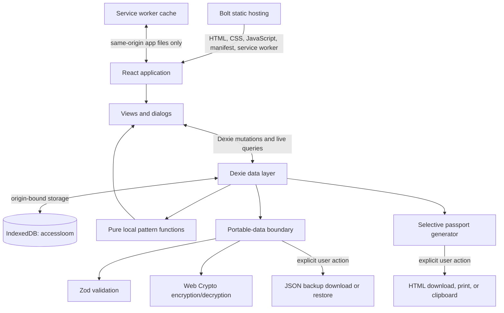

# AccessLoom architecture

AccessLoom is a private, local-first workability lab and selective-share access
passport. Its architectural constraint is simple: the useful product must work
without an account or application backend.

Bolt is a static delivery layer, not a data processor. After the application
files load, records, analysis, backup encryption, and passport generation all
happen in the user's browser.

## System overview



There is no runtime path from IndexedDB to Bolt, GitHub, an analytics vendor, or
an application API.

## Runtime layers

| Layer | Current implementation | Responsibility |
| --- | --- | --- |
| Entry point | `src/main.tsx` | Mounts the React application and global styles. |
| Coordination | `src/App.tsx` | Loads live records, owns modal state and display preferences, and maps URL hashes to views. |
| Shell and views | `src/components/` and `src/views/` | Accessible interaction, check-ins, support experiments, descriptive patterns, commitments, and passport editing. |
| Persistence | `src/db.ts` | Defines the versioned Dexie database and atomic workspace initialization/reset operations. |
| Derived signals | `src/lib/analytics.ts` | Computes descriptive summaries from in-memory records without network calls or stored profiles. |
| Portability | `src/lib/portable.ts` | Validates backup data, encrypts/decrypts exports, atomically restores data, and generates shareable passport output. |
| Offline shell | `public/sw.js` and `public/manifest.webmanifest` | Caches same-origin application files and provides optional install/offline behavior. |
| Build | Vite and TypeScript | Produces static assets in `dist/`; no server bundle is required. |

Hash navigation is implemented directly in `src/App.tsx`. The valid fragments
are `today`, `patterns`, `supports`, and `passport`. Unknown or absent fragments
resolve to Today. Because fragments are not sent in HTTP requests, static
hosting needs no route rewrite.

## Persistent data model

The IndexedDB database is named `accessloom`. Dexie schema version 2 has four
tables. Version 2 adds the `commitments.createdAt` index without clearing
existing records:

| Table | Primary key | Important indexes and relationships | Purpose |
| --- | --- | --- | --- |
| `workspace` | `key`, currently always `"workspace"` | One record containing profile and passport-section choices | Initialization state and the user-controlled passport profile. |
| `adjustments` | `id` | `status`, `barrier`, `reviewDate`, `includeInPassport`, `updatedAt` | Support ideas, time-bounded trials, ratings, review notes, and selective-share state. |
| `checkIns` | `id` | `recordedAt`, `context`, `barrier`, multi-entry `supportIds` | Observed friction, capacity before/after, supports used, notes, and wins. |
| `commitments` | `id` | `status`, `dueDate`, optional `adjustmentId`, `createdAt` | Follow-through actions, owners, dates, and completion state. |

IDs normally use `crypto.randomUUID()` with a record-type prefix. Check-ins keep
both support IDs and a support-label snapshot, so historical observations remain
understandable if a support is later renamed.

Display preferences are intentionally separate from domain records. Text scale,
contrast, and motion preferences live in `localStorage` under
`accessloom-display`. All substantive workspace records live in IndexedDB.

Starting a blank workspace, loading the fictional demo, and clearing the
workspace operate on all four IndexedDB tables in a Dexie transaction. Demo data
uses the same model and code paths as user-created data; `workspace.isDemo`
keeps its status visible.

## Read, write, and analysis flow

`src/App.tsx` uses `dexie-react-hooks` live queries for the workspace,
adjustments, check-ins, and commitments. A committed Dexie mutation therefore
updates the relevant React view without polling or a server round trip.

Dialogs write typed records directly to Dexie:

- `CheckInDialog` adds observations;
- `AdjustmentDialog` creates or updates support experiments;
- `CommitmentDialog` adds follow-through actions;
- Today, Supports, and Passport perform small targeted updates.

Pattern calculations are pure functions over arrays already read from
IndexedDB. They compare friction with and without a selected support in that
support's most-recorded work context. For a dated trial, the with-support side
begins at the trial start; the no-support side can include up to 28 prior
baseline days; both stop at the review date or today. “Promising” requires at
least two matched uses, one matched baseline entry, friction at least 0.5 points
lower with the support, and no large average capacity drop. These are
descriptive heuristics, not statistical, medical, employment, or legal
determinations. No model training, remote AI, or behavioral profiling occurs.

The current application loads each table into memory. That is appropriate for a
personal journal-sized dataset. If future use produces very large histories,
add indexed date windows and aggregation without changing the local-first
boundary.

## Backup and restore boundary

The complete portable payload has `schemaVersion: 1` and contains:

- the workspace record;
- all adjustments;
- all check-ins;
- all commitments;
- an export timestamp.

Plain export writes readable JSON. It is maximally portable and should be
treated as sensitive wherever it is stored.

Encrypted export uses the browser's native Web Crypto API:

- AES-GCM with a 256-bit key;
- PBKDF2-SHA-256 with 310,000 iterations;
- a random 16-byte salt;
- a random 12-byte initialization vector;
- an envelope format and version that are independent of the inner backup
  schema.

The passphrase and derived key are not stored. There is no reset or recovery
path, so the export form requires the passphrase twice before enabling
encryption. AES-GCM protects confidentiality and detects modification of the
exported file, but this encryption applies only to that file. The live IndexedDB
database is not encrypted by AccessLoom and remains protected by the browser
profile, device access controls, and same-origin boundary.

Restore is preceded by an explicit replacement warning, then follows this
order:

1. reject empty files and files larger than 25 MB;
2. read JSON from the user-selected file;
3. detect and, when necessary, decrypt the encrypted envelope;
4. validate KDF parameters, salt/IV sizes, dates, field lengths, array counts,
   numeric ranges, and the complete inner payload with Zod;
5. begin a Dexie transaction;
6. clear all four tables and insert the validated records.

Invalid data or an incorrect passphrase fails before the replacement
transaction. A valid import is intentionally a full replacement, not a merge,
so users should export the current workspace before restoring another backup.

Backup files are the supported migration mechanism between origins, domains,
browsers, and devices.

## Selective sharing

Raw check-ins and private notes are never promoted into the access passport.

The user controls two gates:

1. profile sections can be included or excluded;
2. each adjustment has an `includeInPassport` choice.

For each selected support, the passport generator includes its shareable setup,
status, success marker, personal ratings, and—when linked observations
exist—a count-and-average summary. The aggregate includes no activity, context,
note, win, timestamp, or individual entry, and is labeled as a descriptive
association rather than causal evidence. Private adjustment notes are excluded
by every passport output path.

The generator produces equivalent escaped plain text and standalone escaped
HTML. The HTML can be downloaded and printed without a server. Conversation
drafts similarly describe a selected support and barrier without including raw
check-in history. Copying a draft places it on the operating system clipboard
only after an explicit user action.

Generated files, printing, clipboard use, and opening external guidance links
are deliberate exits from the application's local boundary. The interface must
continue to make those exits visible and user initiated.

## Security and privacy boundaries

### What the design protects

- No AccessLoom account exists.
- No workspace record is uploaded by application code.
- No third-party JavaScript, remote font, telemetry SDK, ad network, or runtime
  application API is loaded.
- The service worker caches code and static assets, not workspace records.
- Backup parsing uses an explicit versioned and size-bounded schema.
- Encrypted backups use authenticated encryption entirely on-device.
- Generated passport HTML escapes user-controlled values before interpolation.
- Only user-selected passport content is made shareable.
- The only optional build variable, `VITE_SOURCE_URL`, is public metadata.

### What the design does not protect

- Local-first does not mean encrypted at rest. Someone with access to the
  unlocked browser profile may be able to inspect IndexedDB.
- Malicious same-origin JavaScript or a successful cross-site-scripting attack
  could read the database. Keeping third-party scripts out and reviewing
  dependencies remain important.
- Browser extensions, operating-system compromise, screenshots, clipboard
  history, downloaded files, and printed documents are outside AccessLoom's
  control.
- Clearing site data, losing a browser profile, or changing origins can make the
  live database unavailable.
- Durable-storage permission reduces eviction risk but is not a backup.
- A service-worker cache improves availability but is not a data backup.

The origin is a security and storage boundary. A Bolt preview, one
`*.bolt.host` name, another hostname, and a custom domain each receive a
different IndexedDB database. Export before changing the origin and restore
afterward.

## PWA boundary

The PWA is progressive enhancement:

- `PwaUpdateToast` registers `/sw.js` only in a production build and only when
  the browser supports service workers.
- navigation requests are network-first with cached `index.html` as the offline
  fallback;
- fetched same-origin static assets are cache-first;
- cross-origin requests and non-GET requests are ignored;
- a waiting worker activates only after the user chooses **Update**;
- the app remains an ordinary static website if registration or installation
  is unavailable.

`CACHE_VERSION` is manual release state. It must be incremented when a release
should install a new cache and show the update prompt. Root-relative service
worker and manifest paths assume deployment at the origin root.

## Build-time and host boundary

The production build is:

```text
TypeScript project build → Vite bundle → dist/
```

Bolt serves `dist/` as static content. It never needs the project's development
dependencies at runtime. Source maps are currently enabled in `vite.config.ts`;
browsers do not normally request them, but they support debugging and source
inspection.

Hosting traffic should be limited to initial and updated application assets.
There are no Bolt Database, file-storage, or server-function calls. This keeps
the project comfortably aligned with free static-host limits and makes the
application deployable on another standards-compliant static host.

## Optional, replaceable sync

Cross-device sync is a possible future enhancement, not part of the present
privacy promise. It must remain optional, clearly disclosed, and replaceable.

The current UI imports the concrete `db` object in several components. Before
adding sync, introduce a repository boundary rather than scattering a cloud SDK
through the views. A future design should:

1. Define storage operations and observable queries behind application-owned
   interfaces.
2. Keep the Dexie implementation as the default and fully functional provider.
3. Add `updatedAt` metadata to every mutable record, deletion tombstones,
   schema/provider versions, and an explicit conflict policy. Current check-ins
   and commitments do not contain enough mutation metadata for robust
   bidirectional conflict resolution.
4. Put any sync implementation in a separate adapter package or module.
5. Require an explicit opt-in and a clear explanation of what leaves the
   device.
6. Keep complete export/import available regardless of sync provider.
7. Store schema migrations and access policies in the public repository.
8. Never expose an administrative or service-role credential to Vite client
   code.

Supabase/Postgres is one possible FLOSS, self-hostable adapter, but it should not
become the domain model. Row-level security would be mandatory for hosted
per-user records. Row-level security is not end-to-end encryption: if the goal
is that a sync operator cannot read records, client-side encryption and a
separate recovery/key-management design are also required.

Provider failure, sign-out, or removal must leave the local workspace usable.
The core promise remains: users can notice, experiment, learn, and create a
passport without a network account.

## Architectural non-goals

The current project deliberately does not provide:

- employer or clinician dashboards;
- hidden monitoring or productivity scoring;
- automatic medical or legal conclusions;
- cloud collaboration;
- diagnosis collection;
- server-side document generation;
- a proprietary AI assistant;
- silent background synchronization.

Changes that introduce any of these behaviors require an explicit product,
privacy, threat-model, and licensing review rather than an incidental
implementation shortcut.
